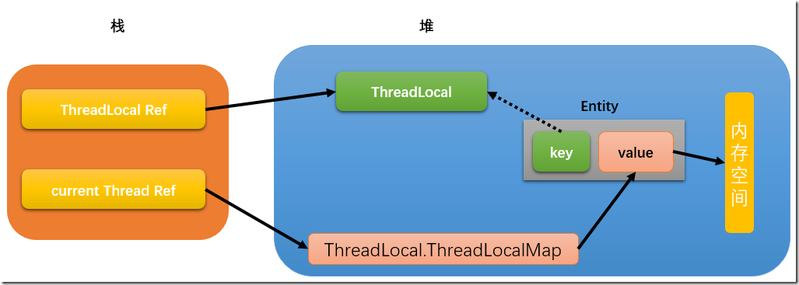
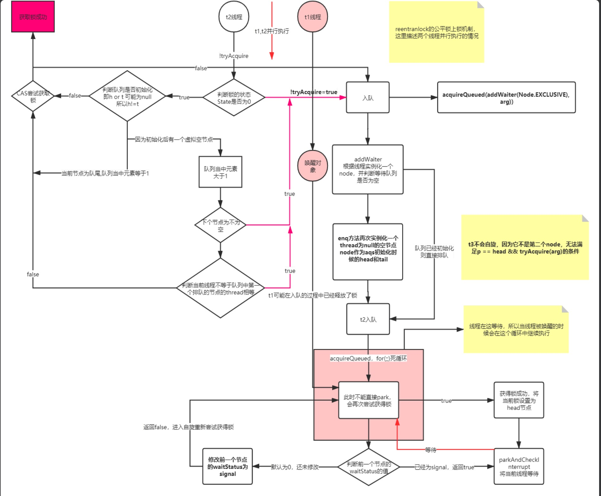
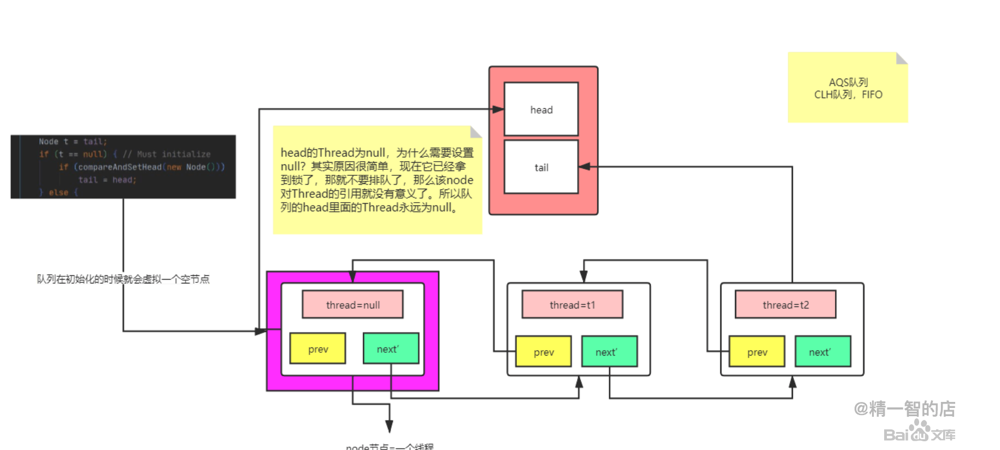
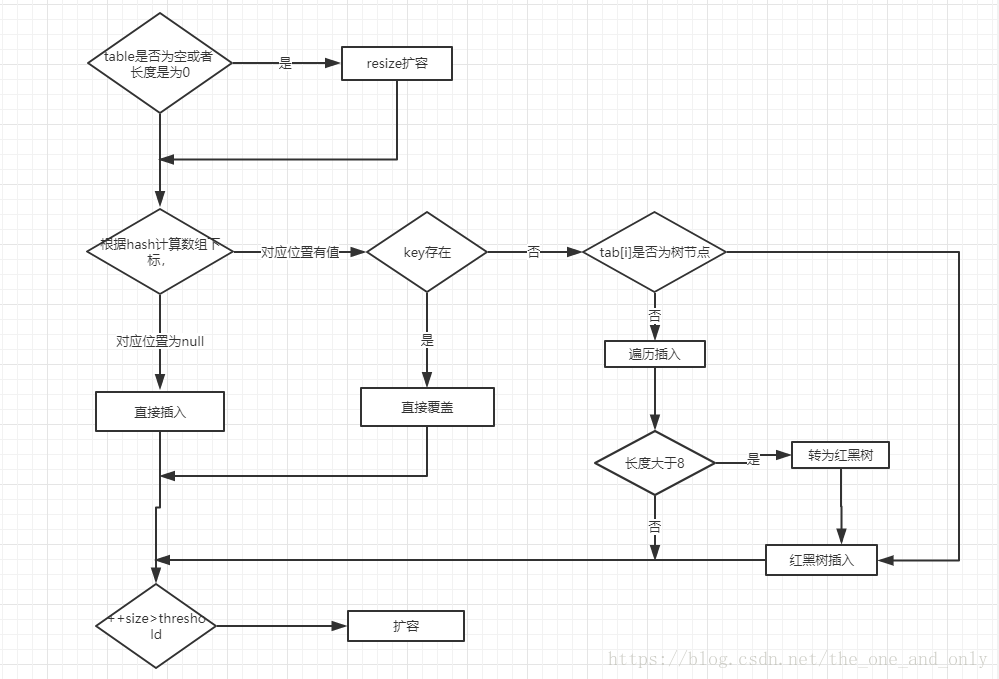

# Java 基础面试题
[TOC]

## 一、面向对象
### 基础

#### 1、Error、Exception和RuntimeException的区别，作用又是什么？

```
```

#### 2、Lambda 与匿名内部类的区别 [[参考]](https://blog.csdn.net/u013096088/article/details/70475981?utm_medium=distribute.pc_relevant.none-task-blog-2~default~BlogCommendFromMachineLearnPai2~default-1.control&dist_request_id=&depth_1-utm_source=distribute.pc_relevant.none-task-blog-2~default~BlogCommendFromMachineLearnPai2~default-1.control)
```
1、匿名内部类表达式会确保创建一个拥有唯一标识的新对象，而lambda表达式的计算机结果可能有，也可能没有唯一标识，这取决于具体实现。
   相对于对应的内部类来说，这种灵活性可以让平台使用更为高效的实现策略。
2、内部类的声明会创建一个新的命名作用域，在这个作用域中，this与super指的是内部类本身的当前实例；相反，lambda表达式并不会引入任何新的命名环境。
    这样就避免了内部类名称查找的复杂性，名称查找会导致很多小错误，例如想要调用外围实例方法时却错误地调用了内部类实例的Object方法

```
#### 3、StringBuffer 和StringBuilder、String
```
String内部维护的一个final修饰的char[]、说明不可变
StringBuffer和StringBuilder一个普通的char[] 可以变化
StringBuffer 线程安全(但是可以锁消除)、StringBuilder线程不安全
StringBuffer和StringBuilder的toString方法：
    虽然StringBuffer使用了缓存，但是本质上都一样，每次toString()都会创建一个新的String对象，而不是使用底层的字符数组，
    所以说底层的字符数组仍然是可有变化的。
```
#### 4、并发原子类解决了什么问题
```
1、并发问题
2、ABA问题
3、CAS 操作的原子性是通过 CPU 单条指令完成而保障的。
4、当多个线程同时使用 CAS 更新一个变量时，只有一个线程可以更新成功，其他都失败。失败的线程不会被挂起，可以继续重试 CAS，也可以放弃操作  
```
#### 5、volatile关键字的理解？

```
volatile可以保证内存的可见性，禁止指令重排
volatile写的内存语义：
    当写一个 volatile 变量时，JMM 会把该线程对应的本地内存中的共享变量值刷新到主内存。
volatile读的内存语义：
    当读一个 volatile 变量时，JMM 会把该线程对应的本地内存置为无效。线程接下来将从主内存中读取共享变量      
```
#### 6、volatile如何保证禁止指令重排？
```
​1、写入volatile变量之前的读/写操作被保证 “happen before” 写入volatile变量。
   发生在写入volatile变量之后的读/写操作依然可以重排序到写入volatile变量前，
2、如果读/写操作最初发生在读取volatile变量之后，则读取/写入其他变量不能重排序到发生在读取volatile变量之前。
   发生在读取volatile变量之前的读/写操作依然可以重排序到读取volatile变量后
```
| 是否能重排序| 第二个操作 | 第二个操作 | 第二个操作 |
| :----:| :----:| :----: | :----: |
| 第一个操作 | 普通读/写 | volatile读 |volatile写 |
| 普通读/写 | YES | YES |NO |
| volatile读 | NO | NO |NO |
| volatile写 | YES | NO |NO |

```
总结：
当第二个操作为volatile写操作时,不管第一个操作是什么(普通读写或者volatile读写),都不能进行重排序。这个规则确保volatile写之前的所有操作都不会被重排序到volatile写之后;
当第一个操作为volatile读操作时,不管第二个操作是什么,都不能进行重排序。这个规则确保volatile读之后的所有操作都不会被重排序到volatile读之前;
当第一个操作是volatile写操作时,第二个操作是volatile读操作,不能进行重排序
```
#### 7、ThreadLocal变量？
##### ThreadLocal引用链 图中的虚线表示弱引用。


```
ThreadLocal.ThreadLocalMap  key为Thread对象（虚引用） Value表示存放的值
threadlocal:线程独享的空间,用户线程的临时存储,  
存在的问题：
    如果线程一直运行，由于key是弱引用，因此发生一次GCkey就会发生回收，但是Value却回收不了因此会出现内存溢出， 所以使用完需要将数据移除掉,不然会出现内存溢出
```
## 二、锁机制
### synchronized

#### 1、synchronized特点
```
（1）是一个非公平锁
（2）可重入锁
（3）不可中断
（4）锁优化（锁升级）无锁->偏向锁->轻量级锁->重量级锁
```
#### 2、synchronized升级过程
```
(Java SE 1.6中为了减少获得锁和释放锁带来的 性能消耗而引入的偏向锁和轻量级锁)
Synchronized的升级顺序是 无锁–>偏向锁–>轻量级锁–>重量级锁，顺内不可逆。
偏向锁：
   当一个线程访问同步代码块并获取锁时，会在对象头和栈桢中的锁记录里存储偏向的线程ID，偏向锁时一个可重入锁，以后该线程在进入和退出该同步代码块时
不需要花费CAS操作来加锁、解锁，而只需简单的测试以下对象头的Mark Word里是否存储指向当前线程的偏向锁（当前线程的线程ID），如果测试成功，表示线程
已经获得了锁，如测试失败，则需要在测试下Mark Word中偏向锁的标示是否设置成1（标示当前是偏向锁），如果偏向锁标识是1，则使用CAS进行锁获取，偏向锁
标识不是1，则尝试使用CAS将对象头的偏向锁指向当前线程。上述两种CAS获取锁的操作，如果CAS操作成功则获取到偏向锁，失败则代表出现了锁竞争，需要锁撤
销操作。

锁撤销：
   偏向锁使用了一种等到竞争出现才释放锁的机制，所以当其他线程尝试竞争偏向锁时，持有偏向锁的线程才会释放锁。偏向锁的撤销需要等待拥有偏向锁的线程
达到全局安全点（在这个时间上没有字节码正在执行），会首先暂停拥有偏向锁的线程，然后检查持有偏向锁的线程是否存活，如果线程不处于活动状态，这将锁的
对象的对象头设置成无锁状态，如果线程仍然活着，拥有偏向锁的栈会被执行（判断是否需要持有锁），遍历偏向锁对象的锁记录，查看使用情况。如果还需要持有
偏向锁，则偏向锁升级为轻量级锁。如果不需要持有偏向锁了，则将锁对象恢复成无锁状态，最后唤醒暂停的线程。

轻量级锁：
   线程在执行同步代码块之前，JVM会先在当前的栈桢中创建用于存储锁记录的空间，并将对象头中的Mark Word复制到锁记录中，官方称为Displaced Mark Word。
然后线程尝试使用CAS将对象头中的Mark Word替换为指向锁记录的指针。如果成功，当前线程获得锁，如果失败，表示其他线程竞争锁，当前线程便尝试使用自旋
来获取锁，自旋有一定次数，如果超过设置自旋的次数则升级到重量级锁，或者一个线程在持有锁，一个在自旋，又有第三个来访时，轻量级锁升级为重量级锁，重
量级锁使用除了拥有锁的线程，其他线程都阻塞，防止CPU空转

轻量级锁解锁：
   轻量级解锁时，会使用原子CAS操作来将Displaced Mark Word替换回到对象头，如果成功，则表示没有竞争发生。如果失败表示当前锁存在竞争，锁就会膨
胀成重量级锁

重量级锁：
   Synchronized是非公平锁，Synchronized在线程进入阻塞队列时，等待的线程会先尝试获取锁，如果获取不到就进入阻塞队列，这明显已经进入队列的线程
是不公平的。

```
#### 3、Synchronized优缺点
| 锁| 优点 | 缺点 | 场景 |
| :----:| :----:| :----: | :----: |
| 偏向锁 | 加解锁不需要过多的资源消耗，和非同步方法相比仅仅是纳秒的级别 | 如果存在竞争，会有额外的锁撤销操作 |适合只有一个线程访问的场景 |
| 轻量级锁 | 竞争线程不会阻塞，会自旋，减少上线文切换 | 如果始终得不到锁，会消耗CPU资源 |追求响应时间，同步代码块多为计算，执行快的场景 |
| 重量级锁 | 没啥优点 | 线程阻塞响应时间慢 |同步代码块执行时间较长的场景使用 |

#### 4、Synchronized锁升级流程


#### 5、Synchronized的锁方法和同步代码块的区别
```
代码块：
   1、使用monitorenter和monitorexit指令，其中monitorenter指令指向同步代码块开始的位置，monitorexit指令则指明同步代码块结束的位置
   2、当执行monitorenter指令时，当前线程将试图获取objectref（即对象锁）所对应的monitor的持有权，当objectref的monitor的的计数器为0，
      那线程可以成功获得monitor，并将计数器设置为1，获取锁成功
   3、如果当前线程已经拥有objectref的monitor的持有权，那它可以重入这个monitor（关于重入性稍后会分析），重入时计数器的值会加1
   4、倘若其他线程已经拥有objectref的monitor的持有权，那当前线程将被阻塞，直到正在执行线程执行完毕，即monitorexit指令被执行，执行线程将释
      放monitor（锁）并设置计算器为0，其他线程将有机会持有monitor
   5、值得注意的是编译器将会确保无论方法通过何种方式完成，方法中调用过的每条 monitorenter 指令都有执行其对应 monitorexit 指令，而无论这个
      方法是正常结束还是异常结束。为了保证在方法异常完成时 monitorenter 和 monitorexit 指令依然可以正确配对执行，编译器会自动产生一个异常
      处理器，这个异常处理器声明可处理所有的异常，它的目的就是用来执行 monitorexit 指令。从字节码中也可以看出多了一个monitorexit指令，
       它就是异常结束时被执行的释放monitor 的指令。

代码块：
    方法级的同步是隐式，即无需通过字节码指令来控制的，它实现在方法调用和返回操作之中。JVM可以从方法常量池中的方法表结构(method_info Structure) 
    中的 ACC_SYNCHRONIZED 访问标志区分一个方法是否同步方法。当方法调用时，调用指令将会检查方法的 ACC_SYNCHRONIZED访问标志是否被设置，
    如果设置了，执行线程将先持有monitor（虚拟机规范中用的是管程一词），然后再执行方法，最后再方法完成(无论是正常完成还是非正常完成)时释放monitor。
```

#### 6、Mark Word存储的信息
```
Mark Word用于存储对象自身的运行时数据，如哈希码（HashCode）、GC分代年龄、锁状态标志、线程持有的锁、偏向线程 ID、偏向时间戳等等。
Java对象头一般占有两个机器码（在32位虚拟机中，1个机器码等于4字节，也就是32bit）。
```


#### 7、wait和notify为什么需要在synchronized里面
```
wait方法的语义有两个，一个是释放当前的对象锁、另一个是使得当前线程进入阻塞队列，而这些操作都和监视器是相关的，所以wait必须要获得一个监视器锁。
而对于notify来说也是一样，它是唤醒一个线程，既然要去唤醒，首先得知道它在哪里，所以就必须要找到这个对象获取到这个对象的锁，然后到这个对象的等待队列中去唤醒一个线程。
```
#### 8、wait和sleep的区别
```
wait和sleep区别在于wait会释放锁， 但是sleep不会释放锁 ，sleep会导致线程阻塞挂起。
wait/wait(timeout)/notify/notifyAll 方法仅可以在获取到锁后才可以使用。
```

### lock 、ReentrantLock

#### 1、ReentrantLock特点
```
（1）实现两种方式公平锁、非公平锁
（2）可重入锁
（3）可中断
```
#### 2、ReentrantLock公平锁加锁流程图  [[参考]](https://blog.csdn.net/qq_30257149/article/details/99588688)

#### 3、ReentrantLock中CLH队列流程图



## 三、集合
#### 1、hashMap put方法流程？


#### 2、hashMap 1.7-1.8的区别？
```
1、Java1.7用的是头插法，而Java1.8采用的是尾插法，因为java1.7使用但链表纵向延伸，当采用头插法是可以提高插入效率，但是也容易出现逆序切环形链表
    死循环问题，但是Java1.8之后是因为加入了红黑树使用尾插法，能够避免出现逆序切链表死循环问题
2、扩容后数据存储位置的计算方式不一样
   Java1.7直接使用的hash值和需要扩容的二进制进行&操作，java1.8采用啦Java1.7的计算方式，也就是扩容前的原始位置+扩容的大小值=Java1.8的计算方式，
    这中方式只需要判断hash的新增参与运算的位是0还是1就可以计算出扩容后的位置
3、Java1.7使用的是数组+单链表数据结构，Java1.8之后采用的是数组+链表+红黑树的数据结构（当链表深度达到8时，就会自动扩容把链表转换成红黑树 
    时间复杂度从O(n)变成O(logN)提高了查询效率）

```

#### 3、hashmap初始化容量应该设置成多少合适？
```
当HashMap内部维护的哈希表的容量达到75%时（默认情况下），会触发rehash，而rehash的过程是比较耗费时间的,所以初始化容量要设置成expectedSize/0.75 + 1的话，可以有效的减少冲突也可以减小误差.
```
#### 4、hashMap key值选取？
```
String, Interger这样的wrapper类作为HashMap的键是再适合不过了，而且String最为常用。因为String是不可变的，比如你放进去的key是"str1"，那就永远是"str1"，不会又变成"str2"，但如果放进去的是一个对象，那万一这个对象里的属性变了，那不就改变key了。
```
#### 5、hashMap 和hashtable区别？
```
1、是否加锁
2、hashmap的key可以为空 
3、迭代器hashMap是fail-fast 在遍历元素的时候删除、新增数据，将会抛出ConcurrentModificationException
``` 
#### 6、ConcurrentHashMap的size方法？
``` 
1、分析一下 sumCount() 代码。ConcurrentHashMap 提供了 baseCount、counterCells 两个辅助变量和一个 CounterCell 辅助内部类。
    sumCount() 就是迭代 counterCells 来统计 sum 的过程。 put 操作时，肯定会影响 size()，在 put() 方法最后会调用 addCount() 方法。
2、addCount() 代码如下：
     如果 counterCells == null, 则对 baseCount 做 CAS 自增操作。
     如果并发导致 baseCount CAS 失败了使用 counterCells。
     如果counterCells CAS 失败了，在 fullAddCount 方法中，会继续死循环操作，直到成功。
3、然后，CounterCell 这个类到底是什么？我们会发现它使用了 @sun.misc.Contended 标记的类，内部包含一个 volatile 变量。
    @sun.misc.Contended 这个注解标识着这个类防止需要防止 “伪共享”。那么，什么又是伪共享呢？

缓存行介绍(延伸的知识):
   缓存系统中是以缓存行（cacheline）为单位存储的。缓存行是2的整数幂个连续字节，一般为32-256个字节。最常见的缓存行大小是64个字节。当多线程修改互相独立的变量时，如果这些变量共享同一个缓存行，就会无意中影响彼此的性能，这就是伪共享。
``` 
#### 7、HashMap的长度为什么要是2的n次方？
```
HashMap为了存取高效，要尽量较少碰撞，就是要尽量把数据分配均匀，每个链表长度大致相同，
这个实现就在把数据存到哪个链表中的算法，这个算法实际就是取模，hash%length，计算机中直接求余效率不如位移运算，源码中做了优化hash&(length-1)，
hash%length==hash&(length-1)的前提是length是2的n次方；
为什么这样能均匀分布减少碰撞呢？2的n次方实际就是1后面n个0，2的n次方-1  实际就是n个1；
    例如长度为9时候，3&(9-1)=0  2&(9-1)=0 ，都在0上，碰撞了；
    例如长度为8时候，3&(8-1)=3  2&(8-1)=2 ，不同位置上，不碰撞；
```
#### 8、为什么要将链表中转红黑树的阈值设为8
```
1、每次遍历一个链表，平均查找的时间复杂度是 O(n)，n 是链表的长度。红黑树有和链表不一样的查找性能，由于红黑树有自平衡的特点，可以防止不平衡情况
    的发生，所以可以始终将查找的时间复杂度控制在 O(log(n))。最初链表还不是很长，所以可能 O(n) 和 O(log(n)) 的区别不大，但是如果链表越来越长，
    那么这种区别便会有所体现。所以为了提升查找性能，需要把链表转化为红黑树的形式。
2、还要注意很重要的一点，单个 TreeNode 需要占用的空间大约是普通 Node 的两倍，所以只有当包含足够多的 Nodes 时才会转成 TreeNodes，而是否足
    够多就是由 TREEIFY_THRESHOLD 的值决定的。而当桶中节点数由于移除或者 resize 变少后，又会变回普通的链表的形式，以便节省空间。
3、默认是链表长度达到 8 就转成红黑树，而当长度降到 6 就转换回去，这体现了 时间和空间平衡的思想，最开始使用链表的时候，空间占用是比较少的，
    而且由于链表短，所以查询时间也没有太大的问题。可是当链表越来越长，需要用红黑树的形式来保证查询的效率。
总结：
    如果开发中发现 HashMap 内部出现了红黑树的结构，那可能是我们的哈希算法出了问题，所以需要选用合适的hashCode方法，以便减少冲突。
    事实上，链表长度超过 8 就转为红黑树的设计，更多的是为了防止用户自己实现了不好的哈希算法时导致链表过长，从而导致查询效率低，而此时转为红黑树更多的是一种保底策略，用来保证极端情况下查询的效率。

```


```
```


    


