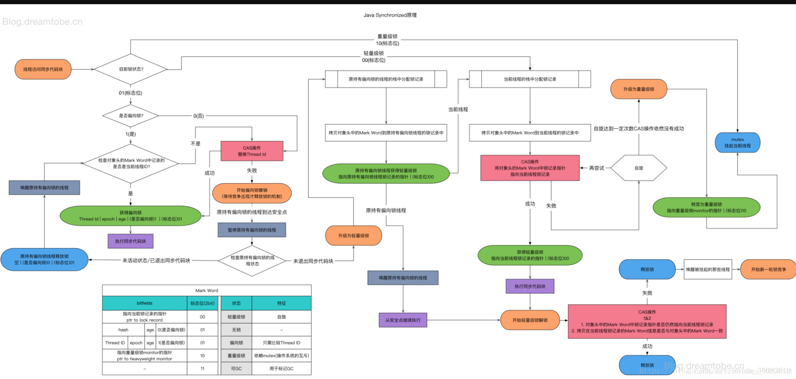
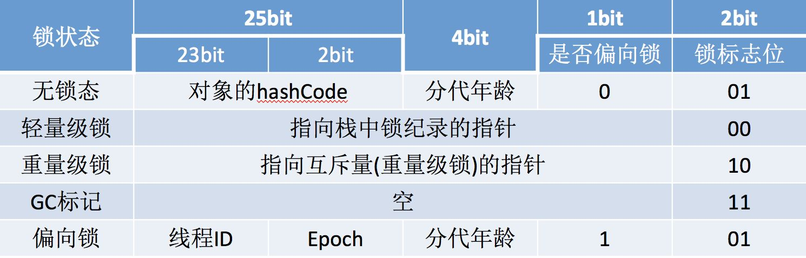

# Java 基础面试题
[TOC]

## 一、面向对象

### 1、private修饰的方法可以通过反射访问,那么private的意义是什么? [[参考]](https://www.jianshu.com/p/a328cf491e06)
```
private想表达的不是“安全性”的意思，而是OOP的封装概念。
```
### Error、Exception和RuntimeException的区别，作用又是什么？

```
```
## 二、锁机制
### synchronized

#### 1、synchronized特点
```
（1）是一个非公平锁
（2）可重入锁
（3）不可中断
（4）锁优化（锁升级）无锁->偏向锁->轻量级锁->重量级锁
```
#### 2、synchronized升级过程
```
(Java SE 1.6中为了减少获得锁和释放锁带来的 性能消耗而引入的偏向锁和轻量级锁)
Synchronized的升级顺序是 无锁–>偏向锁–>轻量级锁–>重量级锁，顺内不可逆。
偏向锁：
   当一个线程访问同步代码块并获取锁时，会在对象头和栈桢中的锁记录里存储偏向的线程ID，偏向锁时一个可重入锁，以后该线程在进入和退出该同步代码块时
不需要花费CAS操作来加锁、解锁，而只需简单的测试以下对象头的Mark Word里是否存储指向当前线程的偏向锁（当前线程的线程ID），如果测试成功，表示线程
已经获得了锁，如测试失败，则需要在测试下Mark Word中偏向锁的标示是否设置成1（标示当前是偏向锁），如果偏向锁标识是1，则使用CAS进行锁获取，偏向锁
标识不是1，则尝试使用CAS将对象头的偏向锁指向当前线程。上述两种CAS获取锁的操作，如果CAS操作成功则获取到偏向锁，失败则代表出现了锁竞争，需要锁撤
销操作。

锁撤销：
   偏向锁使用了一种等到竞争出现才释放锁的机制，所以当其他线程尝试竞争偏向锁时，持有偏向锁的线程才会释放锁。偏向锁的撤销需要等待拥有偏向锁的线程
达到全局安全点（在这个时间上没有字节码正在执行），会首先暂停拥有偏向锁的线程，然后检查持有偏向锁的线程是否存活，如果线程不处于活动状态，这将锁的
对象的对象头设置成无锁状态，如果线程仍然活着，拥有偏向锁的栈会被执行（判断是否需要持有锁），遍历偏向锁对象的锁记录，查看使用情况。如果还需要持有
偏向锁，则偏向锁升级为轻量级锁。如果不需要持有偏向锁了，则将锁对象恢复成无锁状态，最后唤醒暂停的线程。

轻量级锁：
   线程在执行同步代码块之前，JVM会先在当前的栈桢中创建用于存储锁记录的空间，并将对象头中的Mark Word复制到锁记录中，官方称为Displaced Mark Word。
然后线程尝试使用CAS将对象头中的Mark Word替换为指向锁记录的指针。如果成功，当前线程获得锁，如果失败，表示其他线程竞争锁，当前线程便尝试使用自旋
来获取锁，自旋有一定次数，如果超过设置自旋的次数则升级到重量级锁，或者一个线程在持有锁，一个在自旋，又有第三个来访时，轻量级锁升级为重量级锁，重
量级锁使用除了拥有锁的线程，其他线程都阻塞，防止CPU空转

轻量级锁解锁：
   轻量级解锁时，会使用原子CAS操作来将Displaced Mark Word替换回到对象头，如果成功，则表示没有竞争发生。如果失败表示当前锁存在竞争，锁就会膨
胀成重量级锁

重量级锁：
   Synchronized是非公平锁，Synchronized在线程进入阻塞队列时，等待的线程会先尝试获取锁，如果获取不到就进入阻塞队列，这明显已经进入队列的线程
是不公平的。

```
#### 3、Synchronized优缺点
| 锁| 优点 | 缺点 | 场景 |
| :----:| :----:| :----: | :----: |
| 偏向锁 | 加解锁不需要过多的资源消耗，和非同步方法相比仅仅是纳秒的级别 | 如果存在竞争，会有额外的锁撤销操作 |适合只有一个线程访问的场景 |
| 轻量级锁 | 竞争线程不会阻塞，会自旋，减少上线文切换 | 如果始终得不到锁，会消耗CPU资源 |追求响应时间，同步代码块多为计算，执行快的场景 |
| 重量级锁 | 没啥优点 | 线程阻塞响应时间慢 |同步代码块执行时间较长的场景使用 |

#### 4、Synchronized锁升级流程


#### 5、Synchronized的锁方法和同步代码块的区别
```
代码块：
   1、使用monitorenter和monitorexit指令，其中monitorenter指令指向同步代码块开始的位置，monitorexit指令则指明同步代码块结束的位置
   2、当执行monitorenter指令时，当前线程将试图获取objectref（即对象锁）所对应的monitor的持有权，当objectref的monitor的的计数器为0，
      那线程可以成功获得monitor，并将计数器设置为1，获取锁成功
   3、如果当前线程已经拥有objectref的monitor的持有权，那它可以重入这个monitor（关于重入性稍后会分析），重入时计数器的值会加1
   4、倘若其他线程已经拥有objectref的monitor的持有权，那当前线程将被阻塞，直到正在执行线程执行完毕，即monitorexit指令被执行，执行线程将释
      放monitor（锁）并设置计算器为0，其他线程将有机会持有monitor
   5、值得注意的是编译器将会确保无论方法通过何种方式完成，方法中调用过的每条 monitorenter 指令都有执行其对应 monitorexit 指令，而无论这个
      方法是正常结束还是异常结束。为了保证在方法异常完成时 monitorenter 和 monitorexit 指令依然可以正确配对执行，编译器会自动产生一个异常
      处理器，这个异常处理器声明可处理所有的异常，它的目的就是用来执行 monitorexit 指令。从字节码中也可以看出多了一个monitorexit指令，
       它就是异常结束时被执行的释放monitor 的指令。

代码块：
    方法级的同步是隐式，即无需通过字节码指令来控制的，它实现在方法调用和返回操作之中。JVM可以从方法常量池中的方法表结构(method_info Structure) 
    中的 ACC_SYNCHRONIZED 访问标志区分一个方法是否同步方法。当方法调用时，调用指令将会检查方法的 ACC_SYNCHRONIZED访问标志是否被设置，
    如果设置了，执行线程将先持有monitor（虚拟机规范中用的是管程一词），然后再执行方法，最后再方法完成(无论是正常完成还是非正常完成)时释放monitor。
```

#### 6、Mark Word存储的信息
```
Mark Word用于存储对象自身的运行时数据，如哈希码（HashCode）、GC分代年龄、锁状态标志、线程持有的锁、偏向线程 ID、偏向时间戳等等。
Java对象头一般占有两个机器码（在32位虚拟机中，1个机器码等于4字节，也就是32bit）。
```


#### 7、wait和notify为什么需要在synchronized里面
```
wait方法的语义有两个，一个是释放当前的对象锁、另一个是使得当前线程进入阻塞队列，而这些操作都和监视器是相关的，所以wait必须要获得一个监视器锁。
而对于notify来说也是一样，它是唤醒一个线程，既然要去唤醒，首先得知道它在哪里，所以就必须要找到这个对象获取到这个对象的锁，然后到这个对象的等待队列中去唤醒一个线程。
```

### lock 、ReentrantLock


