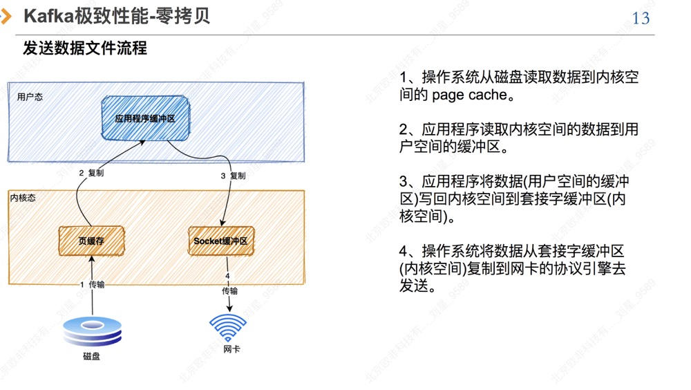
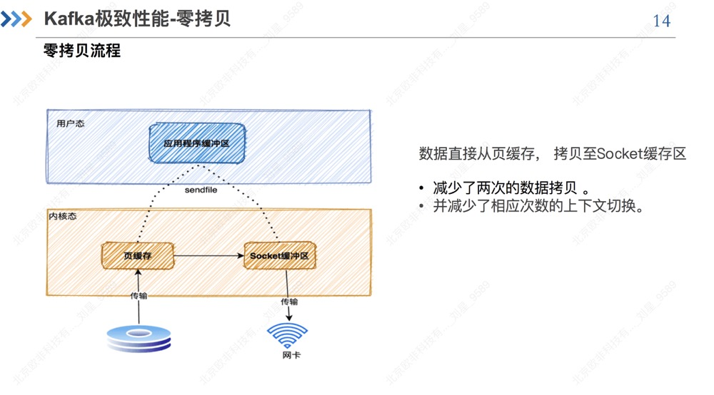

# RocketMq

## 一、rocketMq
### 基础

#### 1、选用mq的原因
```
1、由于我们系统的qps压力比较大，所以性能是首要考虑的要素。
2、开发语言，由于我们的开发语言是java，主要是为了方便二次开发。
3、对于高并发的业务场景是必须的，所以需要支持分布式架构的设计。
4、功能全面，由于不同的业务场景，可能会用到顺序消息、事务消息等。
```

#### 2、rocket发送类型
```
同步、异步、单向
```
#### 3、同步复制、异步复制
```
```
#### 4、同步刷盘、异步刷盘
```
```

#### 5、mq限流
```
消费者维护了一个队列,队列中消息长度达到1000  或者缓存达到100M。隔50ms在重新发起pull
```
#### 6、ack机制
```
消费组+队列记录消费,以一个consumer offset标记这个这个消费组在这条queue上的消费进度。如果使用同一个topic 换个消费组 还可以吧消息在消费一次
```
#### 7、mq丢消息的情况
```
1、因为网络抖动未发送到mq(同步发送存在重试机制默认2次、业务也可以发送重试)
2、写入内存但是没有写入磁盘(使用同步复制)
3、写入磁盘磁盘损坏
4、消息还未消费完就告知mq消费
```
#### 8、mq顺序消费
```
全局顺序:使用一个队列
局部顺序: mq指定MessageListenerOrderly顺序消费,Rroker采用的是分段锁，它不是锁整个Broker而是锁里面的单个Queue，因为只要锁单个Queue就可以保证局部顺序消费了。
```
#### 9、rocketMq 消费端方式拉去数据(长连接，短链接):
```
RocketMQ的消息消费方式，采用了“长轮询”方式，兼具了Push和Pull的优点, 
    即:Client发送消息请求，Server端接受请求，如果发现Server队列里没有新消息，Server端不立即返回，而是持有这个请求一段时间（通过设置超时时间来实现），在这段时间内轮询Server队列内是否有新的消息，如果有新消息，就利用现有的连接返回消息给消费者；如果这段时间内没有新消息进入队列，则返回空。
    长轮询的弊端：在持有消费者请求的这段时间，占用了系统资源，因此长轮询适合客户端连接数可控的业务场景中。
```
#### 10、Master和Slave之间是怎么同步数据的呢:
```
而消息在master和slave之间的同步是根据raft协议来进行的：
    1、在broker收到消息后，会被标记为uncommitted状态
    2、然后会把消息发送给所有的slave
    3、slave在收到消息之后返回ack响应给master
    4、master在收到超过半数的ack之后，把消息标记为committed
    5、发送committed消息给所有slave，slave也修改状态为committed
```
#### 11、mq读写优化:
```
顺序写、随机读
```
#### 12、rocketMq reblance:
```
每次消费端启动、boker发生down机就会发生reblance
```
#### 12、rocketMq 使用PageCash技术:
##### 正常拷贝

##### 零拷贝



 
 


  


